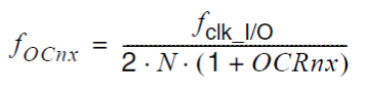
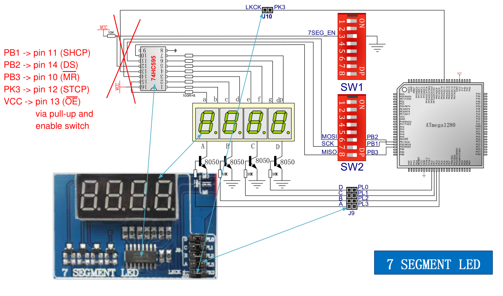

## Before you start:

Make sure the switches are set in the correct state as shown in the diagram, otherwise the specified peripheral won't work correctly or at all.

It is assumed that the reader has some knowledge of port pin configurations and electronics.

## 7 Segment

### Note!

This is a driver for 74HC595 not ATmega 1280's SPI!
The slave select pin is not utilised as Slave to Master communication is not of interest.

The 0-3 pins of port D determine which segment will be lit up. Only one at a time must be driven high.
To print a number with at least 2 digits, the segments will be lit up in sequence. The greater the number of digits, the higher the refresh frequency of the display segment should be in order to provide seamless refreshing. 

### Display updating/refreshing

The display is updated periodically with the use of a timer interrupt. To tune the update frequency, the following formula is utilized:

